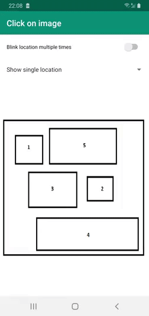

# SimpleImageMapDemo
This is a simple Image Map Demo. 
This demo contains an example image which is a map. 
On click of image you will be able to see that the areas are high lighted. 
When clicking on highlighted area you will be able to see their names. 
The purpose behind creating this demo is it can be used by people in large campus to identify the area were they want to go. 

You can set your or drawable in folder to load image. This image click area are kept by deciding the pixels so that it can be loaded easily in any screen size of android device as well as in desktop. This pixels are taken from image. Pixels are then converted to Dimension Pixel for mobile phone. There is only rectangle support in this demo example. Double tap zooming in and zooming out is limitation in this example. But you can pinch and zoom in zoom out the image.
